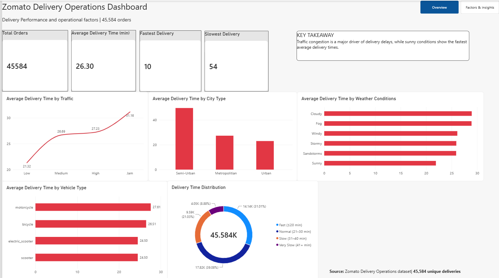
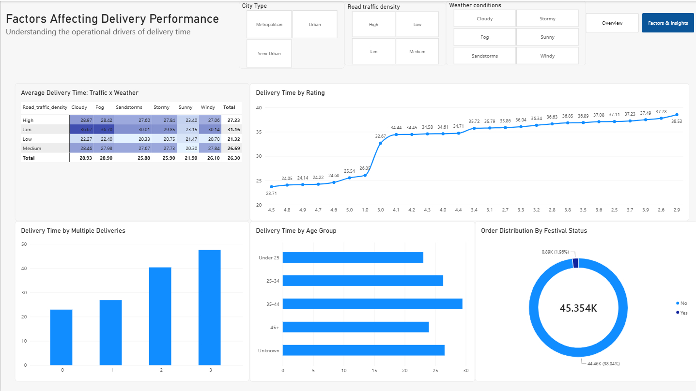

# Zomato Delivery Operations Analysis

##  Project Overview

This project analyzes food delivery operations using a dataset of 45,584 deliveries.

The objective is to understand delivery performance and identify operational factors associated with delivery time, including traffic density, weather conditions, city type, and delivery-related factors.

The analysis was performed using SQL for data preparation and analysis, and Power BI for interactive dashboard development.

##  Tools & Technologies

- MySQL
- SQL
- Microsoft Power BI
- Microsoft Excel

##  Key Performance Metrics

- Total Deliveries: 45,584
- Average Delivery Time: 26.30 minutes
- Fastest Delivery: 10 minutes
- Slowest Delivery: 54 minutes

##  Key Insights

- Higher traffic density is associated with longer average delivery times.
- Jam traffic recorded the highest average delivery time.
- Sunny weather recorded the lowest average delivery time among the weather categories.
- Delivery time varies across city types and operational conditions.
- The dashboard enables users to explore delivery performance through interactive filters.

##  Dashboard Pages

### 1. Overview
- Delivery performance KPIs
- Average delivery time by traffic
- Average delivery time by weather
- Average delivery time by city type
- Delivery time distribution
- Vehicle type analysis

### 2. Factors & Insights
- Traffic and weather analysis
- Multiple deliveries analysis
- Delivery time by rating
- Age group analysis
- Festival order distribution
- Interactive slicers

##  Project Files

- Power BI dashboard
- Dashboard screenshots
- SQL analysis (to be added)

##  Project Objective

To develop practical skills in data cleaning, SQL analysis, data visualization, and business intelligence by analyzing food delivery operations.

##  Author

Aishwarya

## 📸 Dashboard Preview

### Overview

### Factors & Insights

